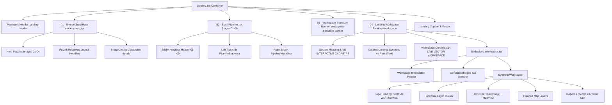

# PHASE UI-07 — LANDING PAGE UX & VISUAL HIERARCHY AUDIT
**Bhumi-Setu MVP — Technical & Evaluator Experience Review**  
*Document Version: 1.0.0 · Date: September 23, 2026*  
*Scope: Frontend Architecture, Visual Hierarchy, Narrative Flow, and Product Transition*

---

## 1. Executive Summary

Bhumi-Setu is an intelligent geospatial reconciliation platform engineered to solve a foundational governance challenge: bringing heterogeneous land-data sources—**legacy Cadastral maps**, **high-resolution aerial drone footprints**, and **centimeter-accurate RTK GNSS observations**—into a unified analytical space, reconciling them through deterministic spatial evidence and machine learning, escalating uncertainty to authorized human officers, and recording every decision in an immutable, append-only audit trail.

The landing page serves a critical audience: **SIH (Smart India Hackathon) jury members, technical evaluators, and senior land-governance officials**. These reviewers have limited time (often under 2–3 minutes) to evaluate the core value proposition:
1. **WHAT IS THIS?** A geospatial reconciliation engine.
2. **WHAT DOES IT DO?** Unifies fragmented land datasets into a single, evidence-backed cadastre.
3. **HOW DOES IT WORK?** Normalization → Spatial Reconciliation → Explainable Evidence → Uncertainty Escalation → Human Review → Immutable Audit → Trusted Picture.
4. **WHERE IS THE ACTUAL PRODUCT?** The interactive Workspace.

### Core Audit Verdict
The current landing page possesses high-value individual components (a cinematic smooth-scroll hero with logo convergence, a 9-stage scroll-driven narrative pipeline, and a live embedded GIS workspace). However, the **overall scrolled experience feels disjointed, cluttered, and confusing**. 

The breakdown occurs primarily at two critical junctions:
1. **The "Intro Stack Collision" (Pipeline → Workspace Transition):** Upon exiting Stage 09 ("Trusted Picture"), the reviewer is subjected to **five separate introductions to the workspace stacked within ~400 vertical pixels**. The page announces "REAL PRODUCT INTERACTION", then "The Bhumi-Setu Workspace", then "LIVE VECTOR WORKSPACE", then "EXPLORE THE WORKSPACE", and finally "SPATIAL WORKSPACE", each with its own headings, subheadings, disclaimer copy, and CTA buttons.
2. **Presentation vs. Product Ambiguity in the Pipeline:** In Stages 06 and 07, mockup triage buttons (`ACCEPT`, `REJECT`, `INVESTIGATE`) look identical to real clickable controls but are non-interactive presentation mockups, while redundant real CTAs (`Review uncertain cases` and `Open Review Queue`) compete for attention on the same screen.
3. **Premature Reference Dataset Disclaimers:** Front-loading the Lalpur real-world reference dataset disclaimers ("Not a cadastral benchmark", "Cadastral truth unavailable") directly into the primary landing flow distracts reviewers and risks giving the false impression that Bhumi-Setu cannot reconcile cadastral records.

---

## 2. Current Landing-Page Architecture

The landing page is composed of modular components rendered in `frontend/src/pages/Landing.tsx`:



### Component Breakdown
| File Path | Role in Landing Experience |
| :--- | :--- |
| `frontend/src/pages/Landing.tsx` | Main page coordinator, header, transition banner, embedded workspace container, footer. |
| `frontend/src/pages/landing.css` | Core design system tokens (`--gov-teal`, `--page-bg`, `--ink`, etc.), typography, header, footer. |
| `frontend/src/pages/landing-presentation.css` | Light institutional overrides for the workspace section, chrome styling, and leaflet overrides. |
| `frontend/src/components/ui/modern-hero.tsx` | Framer Motion scroll hero with 4 parallax source cards, dynamic logo convergence, and image credits. |
| `frontend/src/components/pipeline/ScrollPipeline.tsx` | 2-column scroll container: 9 narrative steps on left, sticky canvas on right, 9-pill sticky top bar. |
| `frontend/src/components/pipeline/PipelineStage.tsx` | Individual narrative stage block: eyebrow, headline, description, tags, evidence strip, optional CTA. |
| `frontend/src/components/pipeline/PipelineVisual.tsx` | Sticky right column: switches SVG/mockups based on activeStage (0 to 8). |
| `frontend/src/components/pipeline/scroll-pipeline.css` | Styles for the 9-stage pipeline, sticky header, stage cards, and visual mockups. |
| `frontend/src/pages/Workspace.tsx` | Full product page, rendered in `embedded` mode inside `Landing.tsx`. |

---

## 3. Actual Scroll Sequence Observed

Testing conducted at standard desktop viewport (`1440 × 900` and `1600 × 1000`):

```
[00:00] VIEWPORT 1: HERO INITIAL
        • Institutional header: Logo + nav (Pipeline, Workspace, Overview) + [Open Workspace ↗]
        • Centered satellite viewport + bold headline: "ONE PARCEL. THREE REALITIES."
        • Subhead: "Turn fragmented land data into one trusted picture."
        • Action: [Explore Workspace ↗] and [See How It Works ↓]
        ↓
[00:03] VIEWPORT 2: HERO PARALLAX
        • User scrolls: 4 source cards float in via parallax:
          01 Cadastral Map → 02 Drone Orthophoto → 03 GNSS Benchmark → 04 Reconciliation.
        ↓
[00:06] VIEWPORT 3: HERO CONVERGENCE & PAYOFF
        • Cards converge into central axis.
        • Bhumi-Setu vector logo expands (~2.6x scale) into prominent center position.
        • "One trusted picture. Machine learning ranks. Evidence explains. People make the decision."
        • Action: [Explore Workspace ↗].
        ↓
[00:08] VIEWPORT 4: HERO EXIT & PIPELINE ENTRY (VISUAL GLITCH)
        • The collapsible `<details>` element ("► About the temporary imagery") bleeds into 
          the top margin above the sticky pipeline header.
        • Dark teal sticky navigation bar (`#005F63`) snaps to top with 9 pills:
          [01 SOURCES] [02 NORMALIZE] [03 RECONCILIATION] [04 EVIDENCE] [05 RESULTS] 
          [06 REVIEW] [07 HUMAN DECISION] [08 AUDIT] [09 TRUSTED PICTURE].
        ↓
[00:10 - 00:25] VIEWPORTS 5–13: THE 9-STAGE PIPELINE
        • Stage 01 Sources: 3-column photo grid of Cadastral, Drone AI, GNSS.
        • Stage 02 Normalize: Coordinate grid + topology repair diagram.
        • Stage 03 Reconciliation: Spatial formula + IoU overlap diagram.
        • Stage 04 Evidence: Confidence breakdown (99.9% ML, 100/100 deterministic, IoU 96%).
        • Stage 05 Results: Triage classification (42 Matched, 11 Review, 3 Conflict).
        • Stage 06 Review: Escalated queue with 3 mock records. Below it: 3 mock buttons 
          (ACCEPT, REJECT, INVESTIGATE). Left column has [Review uncertain cases →].
          Visual right bottom has [Open Review Queue ↗].
        • Stage 07 Human Decision: Officer case record + signature + [Review uncertain cases ↗].
        • Stage 08 Audit: Append-only timeline with 4 timestamped events.
        • Stage 09 Trusted Picture: Converged parcel + building + GNSS point + Reconciled badge.
        ↓
[00:26] VIEWPORT 14: THE "INTRO STACK COLLISION"
        • Reviewer scrolls past Stage 09 and immediately hits:
          1. Green Banner: "REAL PRODUCT INTERACTION / Now investigate the map. / [EXPLORE WORKSPACE →]"
          2. Directly below: "LIVE INTERACTIVE CADASTRE / The Bhumi-Setu Workspace. Direct analysis & verification."
          3. Subtext: Paragraph on Synthetic Benchmark + Paragraph on Real-World Dataset.
          4. Chrome Bar: "[Logo] LIVE VECTOR WORKSPACE | Data sources ↗"
          5. Inside Embedded Workspace: "EXPLORE THE WORKSPACE / Select your sources, run reconciliation..."
          6. Mode Buttons: [Synthetic Benchmark] [Real-World Dataset]
          7. Inside Synthetic Workspace: "SPATIAL WORKSPACE / See the evidence on the ground."
        ↓
[00:30] VIEWPORT 15: LIVE MAP & HARMONIZATION CONTROLS
        • Layer Toolbar: 7 checkboxes (Cadastral, Buildings, GNSS, Results, Drone, Satellite, Street).
        • Left Panel: Harmonization lifecycle panel (Source set, status, Run Again, Clear Results).
        • Center: Leaflet interactive map with 500 parcels.
        ↓
[00:35] VIEWPORT 16: EMBEDDED CLUTTER & FOOTER
        • Planned Map Layers: 3 disabled checkboxes ("Municipal GIS", "Utilities", "Drone / ORI").
        • "Inspect a record": Massive grid of 20 clickable parcel cards (`P0001`–`P0020`).
        • Caption: "The working application, using source geometry..."
        • Footer: Logo + "Intelligent Geospatial Reconciliation / SIH 2026 · MVP".
```

---

## 4. Screenshot / Render Observations

| Viewport Step | Screenshot Artifact | Observed Visual & UX Defects |
| :--- | :--- | :--- |
| **Hero Entry** | `audit01_hero_initial.png` | Clean, atmospheric, high visual impact. Dual CTAs ("Explore Workspace" and "See How It Works") are clear and well positioned. |
| **Pipeline Ingest** | `audit03_pipeline_start.png` | Noticeable visual defect at top: `► About the temporary imagery` is poking through above the sticky pipeline header because `ImageCredits` in `modern-hero.tsx` is rendered outside the hero section without proper container margins. |
| **Stage 04 Evidence** | `audit04_stage_evidence.png` | Strong presentation of explainable metrics. High contrast, clear institutional typography. Good alignment between left narrative and right visual. |
| **Stage 06 Review** | `audit05_stage_review.png` | **Severe CTA & Control Confusion**: Left narrative has `Review uncertain cases →` button. Right visual has three large colored button boxes: `ACCEPT`, `REJECT`, `INVESTIGATE`. Below those three buttons is *another* button: `Open Review Queue ↗`. The three colored buttons look interactive but do nothing on click. |
| **Stage 09 Trusted** | `audit06_stage_trusted.png` | Crisp resolution of the cadastral-building-GNSS convergence with the certification badge. Represents a clear narrative climax. |
| **Workspace Transition** | `audit07_workspace_transition.png` | **Visual Reset & Content Repetition**: Immediately after Stage 09, a pale teal banner declares "REAL PRODUCT INTERACTION / Now investigate the map" with an "EXPLORE WORKSPACE" button. 40px below it, a white header declares "The Bhumi-Setu Workspace. Direct analysis & verification". 30px below that, a chrome bar declares "LIVE VECTOR WORKSPACE". 20px below that, another header declares "EXPLORE THE WORKSPACE". |
| **Embedded Workspace** | `audit08_workspace_section.png` | A total of **6 competing headings** and **3 distinct button rows** appear in a single screenful before the user even sees the map canvas. |
| **Live Map & Controls**| `audit09_workspace_map.png` | The GIS layout itself (RunControl on left, Map on right, Layer toolbar on top) is functional, but the outer border framing makes it look like an iframe trapped inside another website. |
| **Bottom Clutter** | `audit10_footer.png` | Beneath the map, 20 large parcel cards (`P0001` through `P0020`) create 600px of redundant scroll height that duplicates the map's own interactive inspection capability. |

---

## 5. Code-Level Causes of Visual Confusion

### Cause 1: Double-Introduction in `Landing.tsx`
* **File:** `frontend/src/pages/Landing.tsx` (Lines 111–136)
* **Code:**
  ```tsx
  {/* Banner 1 */}
  <section className="workspace-transition-banner">
    <div className="landing-container">
      <p className="landing-eyebrow"><span></span> REAL PRODUCT INTERACTION</p>
      <h2>Now investigate the map.</h2>
      <p>Select a parcel. Inspect its evidence. Trace its source.</p>
      <button className="workspace-transition-cta" onClick={scrollToWorkspace}>
        EXPLORE WORKSPACE <ArrowRight size={16} />
      </button>
    </div>
  </section>

  {/* Banner 2 (immediately adjacent) */}
  <section id="workspace" ref={preview} className="landing-section landing-container workspace-section">
    <div className="wide-section-heading">
      <div>
        <p className="landing-eyebrow">LIVE INTERACTIVE CADASTRE</p>
        <h2>
          The Bhumi-Setu Workspace.<br />
          <span>Direct analysis & verification.</span>
        </h2>
      </div>
      <Link to="/map" className="landing-text-button">
        Open full workspace <ArrowUpRight size={17} />
      </Link>
    </div>
  ```
* **Effect:** The user encounters two large banner sections back-to-back that say the exact same thing: "Here is the map / Here is the workspace". The button `EXPLORE WORKSPACE` in Banner 1 simply scrolls down 80px to Banner 2.

### Cause 2: Workspace Embedded-Mode Heading Leakage
* **File:** `frontend/src/pages/Workspace.tsx` (Lines 244–249 and Lines 54–59)
* **Code:**
  ```tsx
  {/* Workspace.tsx line 244 */}
  {!props.storyMode && (
    <div className="workspace-introduction">
      <span className="eyebrow">EXPLORE THE WORKSPACE</span>
      <p>Select your sources, run reconciliation, and inspect the evidence.</p>
    </div>
  )}

  {/* SyntheticWorkspace line 54 */}
  <div className="page-heading compact">
    <div>
      <span className="eyebrow">SPATIAL WORKSPACE</span>
      <Heading>See the evidence on the ground.</Heading>
      <p>{STUDY_AREA.name} · Select a result parcel to inspect its match.</p>
    </div>
  ```
* **Effect:** When `Workspace.tsx` is rendered as a standalone page (`/map`), these headings make sense. But when embedded inside `Landing.tsx` (`<Workspace embedded={true} />`), these headings are rendered *inside the faux browser container* directly below `Landing.tsx`'s own headings, causing **Headings #3, #4, and #5** to appear.

### Cause 3: Premature Dataset Argumentation in Landing Context
* **File:** `frontend/src/pages/Landing.tsx` (Lines 138–147)
* **Code:**
  ```tsx
  <div className="workspace-context">
    <p>
      <b>Synthetic Benchmark</b> · Pune Study Area<br />
      <span>Controlled cadastral, building and GNSS sources for reconciliation.</span>
    </p>
    <p>
      <b>Real-World Dataset</b> · Lalpur, Ahmedabad, Gujarat<br />
      <span>Authentic building annotations and provenance. Not a cadastral benchmark.</span>
    </p>
  </div>
  ```
* **Effect:** Placed right above the map, this text introduces a complex methodological caveat before the user has even clicked a parcel. Reviewers skimming the page see "Not a cadastral benchmark" and get confused about whether Bhumi-Setu's cadastral matching actually works.

### Cause 4: Duplicate & Pseudo-Interactive Controls in Stage 06/07
* **File:** `frontend/src/components/pipeline/ScrollPipeline.tsx` (Lines 101–104) & `PipelineVisual.tsx` (Lines 437–456)
* **Code:**
  ```tsx
  {/* ScrollPipeline.tsx stage 06 definition */}
  cta: {
    label: 'Review uncertain cases',
    to: '/review',
  }

  {/* PipelineVisual.tsx line 437 */}
  <div className="v-review-triage-options">
    <div className="v-triage-btn accept"><b>ACCEPT</b>...</div>
    <div className="v-triage-btn reject"><b>REJECT</b>...</div>
    <div className="v-triage-btn investigate"><b>INVESTIGATE</b>...</div>
  </div>
  <div className="v-review-footer-action">
    <Link to="/review" className="v-open-review-btn">
      Open Review Queue <ArrowUpRight size={13} />
    </Link>
  </div>
  ```
* **Effect:** There are 3 competing action points in one stage:
  1. The narrative CTA on the left (`Review uncertain cases →`).
  2. The mock buttons on the right (`ACCEPT`, `REJECT`, `INVESTIGATE`), which look clickable with hover effects but have no `onClick`.
  3. The visual CTA on the right bottom (`Open Review Queue ↗`).

### Cause 5: Embedded Workspace Clutter Components
* **File:** `frontend/src/pages/Workspace.tsx` (Lines 202–227)
* **Code:**
  ```tsx
  <div className="planned-map-layers">
    {['Municipal GIS', 'Utilities', 'Drone / ORI imagery'].map(label => (...))}
  </div>

  {!selected && results.features.length > 0 && (
    <section className="panel">
      <div className="section-top">
        <h2>Inspect a record</h2>
        <span className="muted">{filtered.features.length} results in current filter</span>
      </div>
      <div className="record-list">
        {filtered.features.slice(0, 20).map(f => (...))}
      </div>
    </section>
  )}
  ```
* **Effect:** When `Workspace` is embedded on the landing page, rendering 20 full-width buttons (`P0001` through `P0020`) along with disabled "Planned" checkboxes bloats the bottom of the page with 800px of scrolling list items, distracting from the GIS map and the harmonization lifecycle controls.

---

## 6. Critical Issues (Severity: CRITICAL)

### CRIT-1: The 5-Layer "Introduction Stack Collision"
* **Location:** `Landing.tsx` (Lines 111–157) & `Workspace.tsx` (Lines 54–59, 244–249)
* **Symptom:** In a single 400px vertical scroll range, the reviewer encounters 5 nested introductions:
  1. `REAL PRODUCT INTERACTION` / `Now investigate the map.`
  2. `LIVE INTERACTIVE CADASTRE` / `The Bhumi-Setu Workspace. Direct analysis & verification.`
  3. `LIVE VECTOR WORKSPACE` (chrome bar)
  4. `EXPLORE THE WORKSPACE` / `Select your sources, run reconciliation...`
  5. `SPATIAL WORKSPACE` / `See the evidence on the ground.`
* **Reviewer Impact:** Causes severe cognitive friction. Evaluators feel the page is disorganized, stuttering, and unable to cleanly present its own interface.

### CRIT-2: Embedded Workspace Visual Containment Failure & Vertical Sprawl
* **Location:** `Landing.tsx` (Lines 149–168) & `Workspace.tsx` (Lines 202–227)
* **Symptom:** The embedded workspace is wrapped inside multiple nested borders:
  `landing-section` → `landing-workspace` → `workspace-chrome` → `page-heading` → `workspace-layer-toolbar` → `gis-workspace-grid` → `planned-map-layers` → `record-list` (20 cards).
* **Reviewer Impact:** The map feels squeezed into a cramped, noisy sub-frame, followed by a massive wall of 20 record buttons that evaluation judges have no reason to click while on the landing page.

---

## 7. High-Priority Issues (Severity: HIGH)

### HIGH-1: Pseudo-Interactive Buttons vs. Duplicate CTAs in Stage 06/07
* **Location:** `frontend/src/components/pipeline/PipelineVisual.tsx` (Lines 437–456)
* **Symptom:** The `ACCEPT`, `REJECT`, and `INVESTIGATE` triage buttons are styled with cursor pointers and hover states, but clicking them does nothing. Concurrently, both the narrative panel and visual footer provide duplicate links to `/review`.
* **Reviewer Impact:** Evaluators assume the application is broken when clicking `ACCEPT` does nothing.

### HIGH-2: Real-World Dataset vs. Synthetic Benchmark Conflation
* **Location:** `Landing.tsx` (Lines 138–147) & `WorkspaceModes.tsx`
* **Symptom:** High-prominence disclaimers ("Not a cadastral benchmark", "Cadastral truth unavailable") are displayed in the main landing page flow.
* **Reviewer Impact:** Evaluators mistakenly believe Bhumi-Setu cannot reconcile cadastral records, when in reality Lalpur is merely an auxiliary real-world building annotation reference dataset.

### HIGH-3: Hero Image Credits Bleeding into Pipeline Sticky Header
* **Location:** `frontend/src/components/ui/modern-hero.tsx` (Line 194)
* **Symptom:** The collapsible `<details className="hero-image-credits">` element sits directly above `<ScrollPipeline>` without top margin or proper isolation, causing "► About the temporary imagery" to float awkwardly above the dark teal sticky progress bar.
* **Reviewer Impact:** Gives an unpolished, accidental visual overlap right as the reviewer begins the 9-stage pipeline.

---

## 8. Medium & Low Issues (Severity: MEDIUM / LOW)

### MED-1: Border & Card Overuse (Card Fatigue)
* **Severity:** MEDIUM
* **Location:** `frontend/src/pages/landing.css` & `scroll-pipeline.css`
* **Symptom:** Over 40 distinct `#D5E1DF` rectangular borders and cards are visible at once. In `PipelineStage.tsx`, every stage has an eyebrow pill, a tag group, an evidence strip card, and an optional CTA card.
* **Reviewer Impact:** Visual clutter; the eye cannot determine where to focus.

### MED-2: Mobile Fallback Redundancy in Pipeline
* **Severity:** MEDIUM
* **Location:** `frontend/src/components/pipeline/ScrollPipeline.tsx` (Lines 209–216) & `PipelineStage.tsx` (Line 117)
* **Symptom:** In mobile viewports (`max-width: 950px`), `PipelineVisual` is rendered inline inside *every single stage*, mounting 9 heavy SVG/canvas visual instances simultaneously in the DOM.
* **Reviewer Impact:** Severe mobile scrolling lag and layout thrashing.

### MED-3: Inconsistent Typography Hierarchy
* **Severity:** MEDIUM
* **Location:** `landing.css`, `landing-presentation.css`, `scroll-pipeline.css`
* **Symptom:** Five different eyebrow classes exist: `.landing-eyebrow`, `.stage-eyebrow`, `.eyebrow`, `.v-review-queue-header`, and `.layer-toolbar-label`. Each has slightly different font sizes (10px, 11px, 12px, 13px), weights, and letter-spacing tokens.
* **Reviewer Impact:** Subtle lack of visual harmony across sections.

### LOW-1: Redundant Logo in Workspace Chrome
* **Severity:** LOW
* **Location:** `Landing.tsx` (Line 152)
* **Symptom:** The Bhumi-Setu logo is shown in the persistent header, scaled up in the hero payoff, and then shown *again* in the faux chrome bar of the embedded workspace.
* **Reviewer Impact:** Minor branding repetition.

### LOW-2: Misleading "Run a comparison" Link in Footer Caption
* **Severity:** LOW
* **Location:** `Landing.tsx` (Lines 172–174)
* **Symptom:** Link says "Run a comparison →" pointing to `/harmonization`, right underneath the live embedded workspace where the user can already run harmonization directly.
* **Reviewer Impact:** Navigational redundancy.

---

## 9. Pipeline → Workspace Transition Analysis

### The Flawed Sequence (Current)
```
Stage 09: Trusted Picture
    ↓
Section: .workspace-transition-banner
    "REAL PRODUCT INTERACTION"
    "Now investigate the map."
    [EXPLORE WORKSPACE →]
    ↓ (User clicks, scrolls down 80px)
Section: #workspace .landing-section
    "LIVE INTERACTIVE CADASTRE"
    "The Bhumi-Setu Workspace. Direct analysis & verification."
    [Open full workspace ↗]
    Context paragraph (Pune vs. Lalpur)
    ↓
Container: .landing-workspace
    Chrome: "[Logo] LIVE VECTOR WORKSPACE | Data sources ↗"
    ↓
Component: Workspace (embedded)
    "EXPLORE THE WORKSPACE"
    [Synthetic Benchmark] [Real-World Dataset]
    "SPATIAL WORKSPACE / See the evidence on the ground."
    Result filter dropdown
    [LAYERS Toolbar]
    [RunControl Panel] + [MapView Canvas]
    [Planned Map Layers]
    [Inspect a record: 20-card grid]
```

### Why It Fails
1. **False Climax:** Stage 09 is the narrative climax ("FROM FRAGMENTED DATA TO ONE TRACEABLE DECISION"). The reviewer expects to touch the tool next. Instead, they hit two transitional banners before seeing any map.
2. **Double Introduction:** Having a `.workspace-transition-banner` immediately followed by `.workspace-section` with another `<h2>` and another CTA is an obvious anti-pattern.
3. **Embedded Leaks:** `Workspace.tsx` does not suppress its own internal headers (`.workspace-introduction` and `.page-heading`) when `embedded={true}`, producing a comical repetition of product titles.

---

## 10. Synthetic vs. Real-World Dataset Analysis

### Current Problem
Bhumi-Setu operates in two dataset modes:
1. **Synthetic Benchmark (Pune):** Complete 3-way reconciliation benchmark with cadastral parcels, drone footprints, and RTK GNSS observations. **This is the core engine demonstration.**
2. **Real-World Reference (Lalpur, Gujarat):** Staged vector subset of real-world drone-derived building footprints from ProjectVaayu, used solely to demonstrate vector normalization and cryptographic provenance.

Currently, the landing page introduces the Lalpur caveats ("Authentic building annotations and provenance. Not a cadastral benchmark. Cadastral truth, verified parcel correspondence and GNSS relationships are unavailable") right in the primary header of the embedded workspace.

### Finding
* The landing page must **lead with and highlight the Synthetic Benchmark (Pune)**, because it is the only dataset that exercises the full end-to-end reconciliation, evidence scoring, and human review engine.
* The Real-World Dataset mode is valuable secondary proof of vector hygiene and provenance, but it should be accessible as a clean toggle within the workspace toolbar or via a dedicated secondary link, **NOT** as a conflicting narrative paragraph on the landing page.

---

## 11. Recommended Structural Changes (For Next Phase)

1. **Eliminate the Redundant Transition Banner:**
   * Delete `.workspace-transition-banner` from `Landing.tsx`.
   * Directly transition from Stage 09 into the Workspace Section with a single, clear, confident institutional header:
     > **LIVE GEOSPATIAL WORKSPACE**  
     > **Inspect the reconciled cadastre on the ground.**  
     > Select a parcel to evaluate mathematical evidence, or run harmonization to test multi-source reconciliation.
2. **Clean Up Embedded Workspace Props:**
   * Pass `embedded={true}` down cleanly so `Workspace.tsx`:
     - Suppresses the redundant `.workspace-introduction` ("EXPLORE THE WORKSPACE").
     - Suppresses the secondary `.page-heading` ("SPATIAL WORKSPACE / See the evidence on the ground").
     - Suppresses the bottom `.planned-map-layers` box.
     - Suppresses the 20-card `.record-list` ("Inspect a record").
3. **Streamline Dataset Selection:**
   * Remove the static two-paragraph disclaimer from `Landing.tsx`.
   * Let the `WorkspaceModes` tab switcher cleanly indicate `[Synthetic Benchmark (Pune)]` as the active reconciliation engine, and `[Real-World Reference (Lalpur)]` as the vector provenance inspection mode.
4. **Fix Stage 06/07 CTA & Presentation Conflict:**
   * In `PipelineVisual.tsx`, convert the `ACCEPT / REJECT / INVESTIGATE` mockup buttons into clearly marked presentation badges (e.g. "OFFICER TRIAGE ACTIONS: ACCEPT · REJECT · INVESTIGATE") with non-button styling.
   * Provide **one unified CTA per stage** linking to `/review`.

---

## 12. Recommended Visual Changes (For Next Phase)

1. **Reduce Card / Border Density:**
   * Remove the faux OS chrome bar (`.workspace-chrome`) enclosing the embedded workspace. In an institutional GIS application, a clean, direct workspace container with subtle border-radius looks significantly more professional than a fake browser window.
   * Replace heavy multi-nested card borders with clean tonal surface shifts (`#FFFFFF` on `#F5F7F7`).
2. **Contain Hero Image Credits:**
   * Move the `<ImageCredits>` component inside the hero's DOM hierarchy or place it discreetly in the footer, ensuring it never leaks over the sticky pipeline navigation bar.
3. **Consolidate Eyebrow Styling:**
   * Standardize all eyebrows across `landing.css`, `landing-presentation.css`, and `scroll-pipeline.css` onto a single design token:
     `font-family: 'DM Sans', sans-serif; font-size: 11px; font-weight: 700; letter-spacing: 0.8px; text-transform: uppercase; color: #007C83;`
4. **Focused Map Canvas:**
   * Ensure the interactive map in the embedded workspace has maximum visual prominence: clear layer controls on top, RunControl on the left, map in center, and evidence panel docking smoothly on the right when a parcel is selected.

---

## 13. Recommended Copy Changes (For Next Phase)

| Section | Current Cluttered Copy | Proposed Clean Institutional Copy | Rationale |
| :--- | :--- | :--- | :--- |
| **Workspace Transition** | "REAL PRODUCT INTERACTION / Now investigate the map. Select a parcel. Inspect its evidence. Trace its source. [EXPLORE WORKSPACE →]" | *Removed entirely (merged into clean workspace header)* | Eliminates redundant intermediary section. |
| **Workspace Header** | "LIVE INTERACTIVE CADASTRE / The Bhumi-Setu Workspace. Direct analysis & verification. Synthetic Benchmark · Pune... Real-World Dataset · Lalpur..." | **LIVE GEOSPATIAL WORKSPACE**<br>Direct spatial analysis & evidence verification.<br><small>Interactive Pune cadastre with live multi-source reconciliation.</small> | Single, authoritative heading. No premature dataset disclaimers. |
| **Workspace Chrome Bar** | "[Logo] LIVE VECTOR WORKSPACE · Data sources ↗" | *Removed (replaced with clean workspace header)* | Eliminates nested faux-browser chrome. |
| **Stage 06 Triage Visual** | Clickable-looking buttons: `ACCEPT (Confirm Proposal)`, `REJECT (Discard Pairing)`, `INVESTIGATE (Request Field RTK)` | Badged workflow status: `OFFICER ACTIONS: [✓ Accept Pairing] [✕ Discard] [⚑ Request Field RTK]` | Clarifies that this is an illustrative lifecycle state, not broken buttons. |
| **Footer Caption** | "The working application, using source geometry from the backend... Run a comparison →" | "Live demonstrator executing WGS84 / UTM 43N spatial reconciliation against synthetic ground truth. All calculations run client/server live." | Serious, technical, institutional tone. |

---

## 14. Files That SHOULD Be Modified (In Next Implementation Phase)

1. `frontend/src/pages/Landing.tsx`
   - Remove redundant `.workspace-transition-banner`.
   - Simplify `.workspace-section` header and remove repetitive `.workspace-context` paragraphs.
   - Remove faux `.workspace-chrome` bar.
2. `frontend/src/pages/Workspace.tsx`
   - When `embedded={true}`, cleanly suppress `.workspace-introduction`, `.page-heading`, `.planned-map-layers`, and the 20-card `.record-list`.
3. `frontend/src/components/pipeline/PipelineVisual.tsx`
   - Refactor Stage 06 triage buttons from faux-interactive buttons to clear illustrative badges.
   - Clean up duplicate `/review` CTA links in Stage 06 and Stage 07.
4. `frontend/src/components/ui/modern-hero.tsx`
   - Position `<ImageCredits>` so it does not bleed into the sticky pipeline navigation bar.
5. `frontend/src/components/pipeline/scroll-pipeline.css`
   - Remove dead `.workspace-transition-banner` CSS.
   - Streamline spacing and border treatments.
6. `frontend/src/pages/landing-presentation.css`
   - Simplify embedded workspace container styling, removing bulky margins and faux-chrome styling.

---

## 15. Files That MUST NOT Be Modified

Under strict architectural protection rules:
* `backend/*` (all backend logic, algorithms, models)
* `backend/matching.py` (reconciliation scoring engine)
* `frontend/src/components/MapView.tsx` (Leaflet GIS core map renderer)
* `frontend/src/components/EvidencePanel.tsx` (mathematical evidence inspector)
* `frontend/src/components/ReviewQueue.tsx` (human decision review queue)
* `frontend/src/components/AuditTrail.tsx` (immutable audit trail)
* `frontend/src/components/FootprintProvenance.tsx` (SHA-256 and vector provenance)
* `frontend/src/components/ReferenceWorkspace.tsx` (Lalpur real-world reference viewer)
* `frontend/src/components/RunControl.tsx` (harmonization lifecycle state machine)
* `frontend/src/services/api.ts` (API client contracts)
* `frontend/src/types/index.ts` (TypeScript domain models)
* `frontend/src/App.tsx` (application routes and state providers)

---

## 16. Proposed Final Landing-Page Hierarchy

```
┌─────────────────────────────────────────────────────────────────────────────┐
│ 1. PERSISTENT HEADER                                                        │
│    [Logo] भूमि-सेतु | BHUMI-SETU       Pipeline  Workspace  Overview   [Open Workspace ↗]
└─────────────────────────────────────────────────────────────────────────────┘
                                      ↓
┌─────────────────────────────────────────────────────────────────────────────┐
│ 2. CINEMATIC HERO                                                           │
│    "ONE PARCEL. THREE REALITIES."                                           │
│    Parallax Source Cards (Cadastral → Drone → GNSS → Reconciliation)         │
│    Payoff: Prominent Logo Convergence + "One trusted picture."              │
└─────────────────────────────────────────────────────────────────────────────┘
                                      ↓
┌─────────────────────────────────────────────────────────────────────────────┐
│ 3. THE 9-STAGE PIPELINE (Sticky 01–09 Navigation Bar)                       │
│    01 Sources         → Legacy Cadastre + Drone AI + RTK GNSS               │
│    02 Normalize       → CRS Standardize + Topological Repair                │
│    03 Reconciliation  → Multi-dimensional IoU & Containment Scoring         │
│    04 Evidence        → Supervised ML Ranking + Transparent Breakdown       │
│    05 Results         → Triage Classification: Matched / Review / Conflict   │
│    06 Review          → Escalated Queue (Clean badges + [Review Queue →])   │
│    07 Human Decision  → Binding Sign-off + Concurrency Version Lock         │
│    08 Audit           → Append-Only Cryptographic Ledger                    │
│    09 Trusted Picture → Authoritative Unified Cadastre                      │
└─────────────────────────────────────────────────────────────────────────────┘
                                      ↓
┌─────────────────────────────────────────────────────────────────────────────┐
│ 4. DIRECT WORKSPACE ENTRY (Single clean transition — no repeated banners)   │
│    "LIVE GEOSPATIAL WORKSPACE"                                              │
│    "Inspect the reconciled cadastre on the ground."                         │
│    [Synthetic Benchmark (Pune)]  [Real-World Reference (Lalpur)]           │
├─────────────────────────────────────────────────────────────────────────────┤
│    [GIS Toolbar: Layers | Basemaps | Result Filters]                        │
│    ┌───────────────────────────┬──────────────────────────────────────────┐ │
│    │ Harmonization Lifecycle   │ Leaflet Vector Map View                  │ │
│    │ • Source Set Stats        │ • Cadastral Boundaries                   │ │
│    │ • [Run Harmonization]     │ • Building Footprints                    │ │
│    │ • Result Triage Breakdown │ • GNSS Verification Markers              │ │
│    │ • [Review Results →]      │ • Selected Parcel Evidence Dock          │ │
│    └───────────────────────────┴──────────────────────────────────────────┘ │
└─────────────────────────────────────────────────────────────────────────────┘
                                      ↓
┌─────────────────────────────────────────────────────────────────────────────┐
│ 5. INSTITUTIONAL FOOTER                                                     │
│    [Logo] भूमि-सेतु | SIH 2026 · Ministry / State Land Records Architecture │
└─────────────────────────────────────────────────────────────────────────────┘
```

---

## 17. "Before → After" Reviewer Experience

### BEFORE (Current Experience)
> *"I land on the page. The hero looks good and the logo converges nicely. But then I see a random image credits box poking out over the pipeline bar. I scroll through the 9 stages, which are interesting, but when I get to Stage 6 I click ACCEPT and nothing happens—it's just a picture. Then I reach the end of the pipeline and suddenly the page says 'REAL PRODUCT INTERACTION'. Then it says 'The Bhumi-Setu Workspace'. Then it says 'LIVE VECTOR WORKSPACE'. Then it says 'EXPLORE THE WORKSPACE'. Then it says 'SPATIAL WORKSPACE'. Why is it telling me what this is five times? Then there are disclaimers saying it's not a cadastral benchmark. Then I see the map, but it's crammed into a fake browser box, and underneath it is a massive list of 20 buttons for individual parcels that stretches forever. It feels like four different landing pages were glued together."*

### AFTER (Intended Experience)
> *"I land on the page. The hero immediately establishes the problem: one parcel, three conflicting realities. As I scroll, the sources converge into a sharp Bhumi-Setu identity. The sticky pipeline smoothly guides me through the exact technical process: ingest, normalization, matching, evidence, triage, human decision, audit, and the single trusted picture. When the story finishes, there's no stuttering or redundant banners. The page cleanly transitions directly into the Live Geospatial Workspace: 'Inspect the reconciled cadastre on the ground.' The map is expansive and uncluttered. I can toggle layers, run harmonization, see real-time statistics, and click any parcel to inspect its IoU and GNSS evidence. The distinction between the core engine and the real-world reference dataset is crystal clear. I immediately understand that Bhumi-Setu is a mature, serious, defensible land administration platform."*

---

## 18. Audit Verification & Metadata

* **Files Inspected:**
  - `frontend/src/pages/Landing.tsx`
  - `frontend/src/pages/landing.css`
  - `frontend/src/pages/landing-presentation.css`
  - `frontend/src/components/pipeline/ScrollPipeline.tsx`
  - `frontend/src/components/pipeline/PipelineStage.tsx`
  - `frontend/src/components/pipeline/PipelineVisual.tsx`
  - `frontend/src/components/pipeline/scroll-pipeline.css`
  - `frontend/src/components/ui/modern-hero.tsx`
  - `frontend/src/components/ui/modern-hero.css`
  - `frontend/src/pages/Workspace.tsx`
  - `frontend/src/components/RunControl.tsx`
  - `frontend/src/components/MapView.tsx`
  - `frontend/src/components/EvidencePanel.tsx`
  - `frontend/src/components/ReviewQueue.tsx`
  - `frontend/src/components/AuditTrail.tsx`
  - `frontend/src/components/ReferenceWorkspace.tsx`
  - `frontend/src/App.tsx` (routing only)
* **Browser Routes Tested:**
  - `/` (Desktop landing page scroll sequence)
  - `/?mode=real_world_reference` (Real-world reference mode behavior)
  - `/map` (Standalone workspace comparison)
  - `/review` (Human review navigation target)
* **Viewports Evaluated:**
  - `1440 × 900` (Standard desktop presentation)
  - `1600 × 1000` (High-resolution desktop monitor)
* **Status:** Complete. Audit recorded in `PHASE_UI_07_AUDIT.md`. Code changes strictly deferred to implementation phase.
